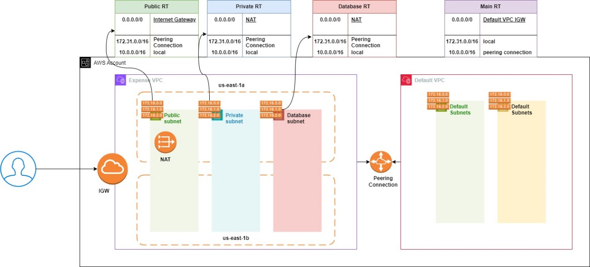

# Custom AWS VPC Module

We are creating following resources.This module creates resources in first 2 availability zones for High availablity.

* VPC
* Interway Gateway
* Internet and VPC attachment
* 2 public subnets
* 2 private subnets
* 2 database subnets
* Elastic Ip
* NAT Gateway
* Public Route Table
* Private RT
* Database RT
* Route Table and subnet associations
* Routes in all tables
* Peering if required for user
* Routes of peering in requestor and acceptor VPC
* Database subnet group

### Inputs
* project_name (Required): User should mention their project name.Type is string
* environment (optional) : Default value is dev. Type is string.
* common_tags (Required): User sholud provide their tags related to their project.Type is map.
* vpc_cidr (optional): Default value is 10.0.0.0/16. Type is string.
* dns_enable_hostnames (optional): Default value is true. Type is bool.  
* vpc_tags (optional): Default value is empty. Type is map.
* igw_tags (optional): Default value is empty. Type is map.
* public_subnet_cidrs (Required): User has to provide 2 valid subnet CIDR. Type is list.
* public_subnet_cidr_tags (optional): Default value is empty. Type is map.
* private_subnet_cidrs (Required): User has to provide 2 valid subnet CIDR. Type is list.
* private_subnet_cidr_tags (optional): Default value is empty. Type is map.
* database_subnet_cidrs (Required): User has to provide 2 valid subnet CIDR. Type is list.
* database_subnet_cidr_tags (optional): Default value is empty. Type is map.
* database_subnet_group_tags (optional): Default value is empty. Type is map.
* aws_nat_gateway_tags (optional): Default value is empty. Type is map.
* public_route_table_tags (optional): Default value is empty. Type is map.
* private_route_table_tags (optional): Default value is empty. Type is map.
* database_route_table_tags (optional): Default value is empty. Type is map.
* is_peering_required (optional): Default value is false. Type is bool.
* acceptor_vpc_id (optional): Default value is empty. default VPC ID wold be taken.Type is string.
* vpc_peering_tags (optional): Default value is empty. Type is map.

### Outputs
